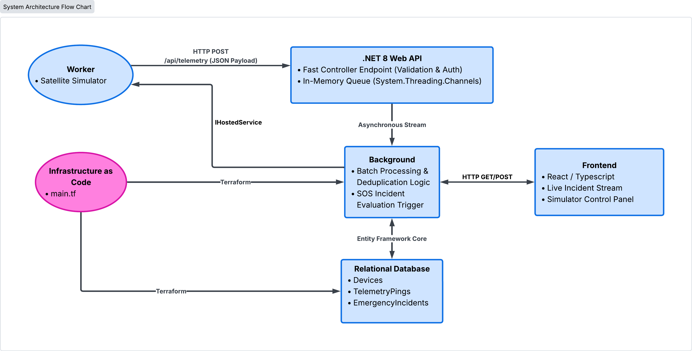
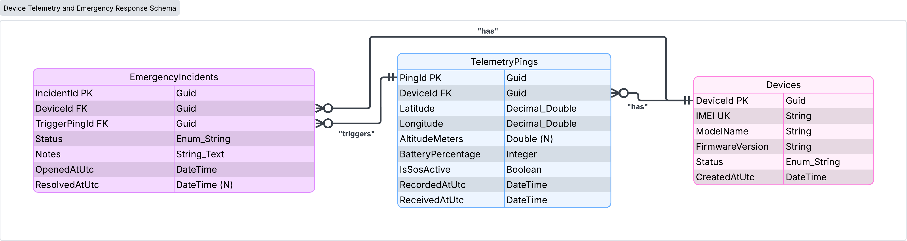

# The Plan - 🛰️ PulseAlert
This plan is to be established before any code is written, to establish clear goals and direction. The content should remain largely unchanged to illustrate the ideas that existed before any issues of implementation arose. 

## 🎯 Vision & Goals
A server and dashboard for tracking GPS devices and responding to SOS signals. 

This project is inspired by Garmin inReach. This service can be critical preparation for outdoorsmen, explorers, and anyone who seeks to go into the untamed wild with a layer of protection from the tamed home. 

The idea is that explorers have devices which contain a GPS tracker, and some kind of SOS button. The device turns on, and it sends location data to a tracking service until the device turns off. In case of an emergency, the explorer can use the SOS button, which alerts the tracking service to an emergency. The tracking service can then call proper authorities to send assistance. 

The tracking service stores the location data on a server, where it can easily be monitored from a dashboard. When an SOS signal is sent, the dashboard alerts the user, who can then take proper action. 

### Core Components 
The project should consist of the following components: 
* A Backend Receiver and Processor: This service will recieve incomming satalite signals. It will feature message validation, and SOS processing. It should be able to handle a large amount of incomming signals without impeding other functionality. 
* A Frontend Monitoring Dashboard: This React app will show the satilite signals on a convenient dashboard. In case of an emergency, it should provide response options. 
* A Relational Database: This will record satilite signals, devices, and ongoing emergencies. 
* Cloud platform hosting: The backend and database must be hosted, and operate on a cloud platform. This cloud platform should be configured using Tarraform. 

The project would need a number of GPS devices signaling to the receiver, but that is unrealistic. Instead a microservice, run by the backend will simulate these signals. 

### 🚫 Out of Scope and Practical Limitations
* Actual functionality of the dashboard is limited. Responding to an emergency should be limited to pressing a "Resolve" button. 
* Realistic GPS locations are of no concern. 
* A realistic system would work over a long time span, and process tens of thousands of signals per hour. For demonstration purposes this system will process much fewer signals and over a shorter period of time. 

## 🛠️ Architecture & Tech Stack
### ​System Architecture

[lucid chart link](https://lucid.app/lucidchart/fd844469-7cf5-42d1-a412-6386b9f16418/edit?beaconFlowId=BF915EC9F170A177&invitationId=inv_0cc85b4f-659d-45fd-9046-f98744155457&page=0_0#)
### Backend Server
* The backend framework will be .NET 8 and an ASP.NET Core Web API.
* Real time web functionality will be done through SignalR. 
#### Worker
The worker is a hosted service running in the background of the app. It simulates a number of explorers, using divices out in the world. Each explorer has a location, speed, battery life, SOS state, and flags to dicate behavior. The explorer will move around, while decreasing their battery life. There will be two things the explorer can do: 
* Deactivate their device, indicating the end of an adventure and no more need of service. 
* Send an SOS, indicating the need for assistance. 
Both of these actions are communicated via a HTTP webhook in the API. 
#### API
The API will use system threading to asynchronously handle incomming requests. 
#### Signal Processing and SOS Evaluation
When  signal is recieved it is first added to the TelemetryPings table, and the if the device is unknown, it is also added to the Devices table. Signal Processing checks for two situations: If an Emergency Incident needs to be created and if a device needs to be activated or deactivated. 

When a device reports telemetry data, a device is set to active. This indicates that the device has been turned on, and the explorer is on their way. Devices need to be deactivated in order to indicate that the explorer no longer needs service. 

Emergency Incidents can be created for two reasons. 
* If a signal comes in reporting an SOS. This indicates that the device user has asked for help. If a signal comes in reporting an SOS, the system first checks if there is already an Emergency Incident in progress. If not it creates a new incident. It is important to note that if a signal comes in, not reporting an SOS, while an active Emergency Incident exists, the incident is not affected. Users cannot "undo" an SOS signal, in the same way they can't un-call 911 or un-pull a fire alarm. 
* If an active device has not transmitted in 10 minutes. This indicates that the device has suddenly stopped working, and the explorer has been unable to report their safety. 

If an Incident is created, the proper entry is added to the database table and the UI is immediately updated. Note that incidents are only resolved via a button on the dashboard.
### Database
Entity Relationship Diagram (ERD)

[lucid chart link](https://lucid.app/lucidchart/fd844469-7cf5-42d1-a412-6386b9f16418/edit?beaconFlowId=BF915EC9F170A177&invitationId=inv_0cc85b4f-659d-45fd-9046-f98744155457&page=0_0#)
* GUIDs will be replaced with VARCHAR to allow for simple, manual, data entry. 
* The database will be made in PostgreSQL and managed with Entity Framework Core. 
### Frontend Dashboard
Wireframe goes here
* The frontend is written in React and uses TypeScript for type safety. 
* State management and data fetching will be done with React Query. 
Incidents are only resolved via a button on the dashboard. 

#### Row 1: Header
Nothing special planned here. 
#### Row 2, Left: System Health and Metrics
#### Row 2, Right: Selected Device Focus
#### Row 3: Emergency Incidents
#### Row 4: Recent Telemetry Live Stream
#### Row 5: Simulator Control Panel
### DevOps & Cloud Infrastructure
* Terraform will be used to provision cloud resources.
* Docker will be used to containerize the .NET backend and web server for local development and deployment. 
* GitHub Actions will be used for builds, tests, and automated code quality checks.

### Quality & Testing
* xUnit & Moq will be used for Unit testing of .NET business logic and alert handlers.
* React Testing Library will be used for Unit and UI component testing.

## 🗺️ Roadmap
* Phase 0: Planning
  * **Goal:** Flesh out idea as much as possible 
  * Establish project scope
  * Write PLAN.md
  * Create visuals
  * Write clear instructions
* Phase 1: Architecture & Data Model
  * **Goal:** Establish the C# solution and database schema.
  * Scaffold .NET 8 Web API Solution:
    * Create a clean layer structure: Core (domain models/interfaces), Infrastructure (EF Core/DB context), API (controllers/endpoints).
  * Design EF Core Data Model:
    * Device: Device ID, model, status.
    * TelemetryPing: GPS coordinates (lat/long/altitude), battery level, timestamp, payload JSON.
    * EmergencyIncident: Status (Active, Acknowledged, Resolved), timestamp, severity.
  * Database Setup:
    * Configure EF Core migrations with PostgreSQL.
* Phase 2: Ingestion Pipeline & Background Processing
  * **Goal:** Build the engine that simulates and processes incoming satellite data.
  * Satellite Ingestion Endpoint:
    * Build a POST /api/telemetry controller endpoint that accepts incoming GPS pings.
    * Add simple validation (checking for corrupted data or duplicate pings).
  * Channel / In-Memory Queue:
    * Use .NET System.Threading.Channels to handle incoming pings asynchronously without blocking HTTP requests.
  * Background Worker (IHostedService):
    * Write a background worker service that reads pings off the channel and writes them to the database in bulk using EF Core.
  * Emergency Trigger Logic:
    * If an incoming ping has SOS_Active = true, auto-create or update an EmergencyIncident record.
* Phase 3: Simple Monitoring Endpoint / Dashboard
  * **Goal:** Provide visibility into system metrics.
  * API Telemetry Status Endpoint:
    * GET /api/metrics: Returns total pings processed per minute, queue depth, and active SOS count.
  * Lightweight React / TypeScript Front End:
    * A 1-page dashboard using React and TypeScript displaying:
      * Live metrics counters.
      * A simulated "Send Ping / Trigger SOS" button to push test payloads to your API.
* Phase 4: Infrastructure as Code (Terraform)
  * **Goal:** Use Terraform in order to manage a cloud deployment.
  * Create terraform/ Directory:
    * Write a modular main.tf file that provisions:
      * An AWS RDS (PostgreSQL) instance.
      * An AWS App Runner hosting the .NET API.
    * Local Validation:
      * Ensure terraform plan runs successfully against local environment variables.
* Phase 5: Testing, Documentation & Polish
  * **Goal:** Packaging for interview discussion.
  * Unit Tests:
    * Add a few xUnit tests covering the ingestion service logic and validation handlers.
  * Comprehensive README.md:
    * Write a clear overview explaining:
      * Decisions made.
      * Instructions to run locally via dotnet run.

## ❓ Remaining Questions
* AWS vs Azure? It shouldn't really matter, whichever is easiest, I guess. 

## 📝 To Do
* Finish Frontend Wireframe
* Finish descibing wireframe
* Correct colors on Architecture Chart
* 